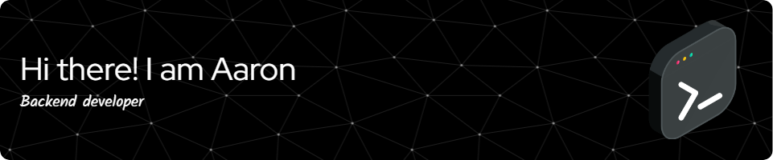

    

# Technologies

## IDEs/Editors

 

## Languages

  

   

## Frameworks, Platforms and Libraries

         

# Stats

## Github

|  |  |
| --------------------------------------------------------------------------------------------------------------------------------------------------------------------------------------------------------------------------------------------------------------------- | -------------------------------------------------------------------------------------------------------------------------------------------------------------------------------------------------------------------------- |

## Leetcode

# Where to find me

  

